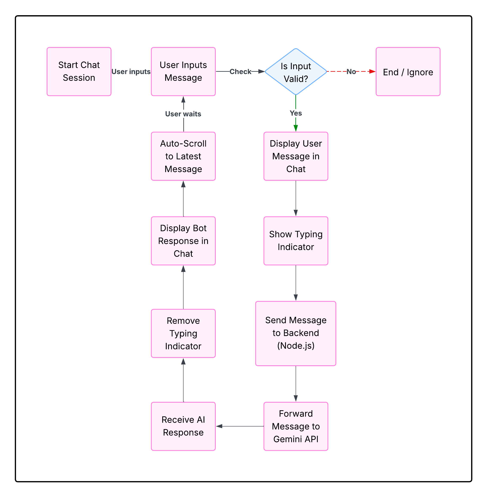

# SmartChat AI

SmartChat AI is a modern and lightweight web-based chatbot application that utilizes Google's **Gemini AI API** to deliver intelligent conversational experiences. Designed for simplicity and extensibility, this project offers a clean UI with a Node.js backend that handles communication between the client and the AI API.

Whether you're building an AI assistant, experimenting with LLMs, or just learning how to integrate APIs in full-stack projects, SmartChat AI serves as a perfect starting point.

---

## 🚀 Features

- AI-powered chat interface using Gemini API  
- Real-time response handling via async communication  
- Clean UI with separate pages for home and chat  
- Frontend: HTML5, CSS3, JavaScript  
- Backend: Node.js + Express  
- API Key secured using environment variables  
- Modular and easy to customize  

---
## 📂 Project Structure

```plaintext
smartchat-ai/
├── public/
│   ├── index.html         # Home page
│   ├── frontend.html      # Chatbot interface
│   ├── style.css          # Styling and layout
│   └── script.js          # Frontend chat logic
├── server.js              # Node.js backend server
├── .env                   # Environment config (Gemini API key)
├── package.json           # Node dependencies
├── LICENSE                # MIT License
└── README.md              # Project documentation
```

---

## 🛠️ Technologies Used

- **Frontend:** HTML, CSS, JavaScript  
- **Backend:** Node.js  
- **AI Integration:** Gemini API  
- **Tools:** Visual Studio Code, Lucidchart, Git, GitHub  

---

## 🧠 How It Works

1. User starts chat session and inputs a message  
2. Message is validated and displayed  
3. Typing animation simulates bot "thinking"  
4. Message is sent to Node.js backend  
5. Backend forwards request to Gemini API  
6. API response is sent back, typing animation is removed  
7. Bot response is displayed with a timestamp  
8. Auto-scroll ensures latest message is in view

---

## ⚙️ Installation & Running Locally

### Prerequisites:
- Node.js installed
- Gemini API key (from Google AI Studio or appropriate platform)

### Steps:

```bash
# 1. Clone the repository
git clone https://github.com/your-username/SmartChat.git
cd SmartChat

# 2. Install backend dependencies
npm install

# 3. Start the Node.js server
node server.js

# 4. Open frontend.html in your browser
```
---
# 📊 Flowchart

System logic is illustrated below to understand flow:



---
## 🧪 Testing

- Unit and integration testing performed  
- Test cases cover valid/invalid input, API responses, UI updates  
- Manual browser testing on Chrome, Firefox, and Edge  
---
## 📌 Future Enhancements

- Add voice input/output capabilities  
- Save and export chat history  
- User login and chat session storage  
- Multi-language support  
---
## 🙋‍♂️ Authors

- **Patil Kaushal Anandra** – Team Leader / Backend Developer  
- **Tanksale Prathmesh Pandurang** – Frontend & UI/UX Designer  
- **Patil Bhavesh Pravin** – Testing & Documentation  
- **Nikam Akash Ravindra** – Research & Presentation  
- **Javale Tushar Ashok** – Research & Presentation  

**Guided By** - Mr. S. D. Salunke  
**Institution** - Department of Computer Engineering, DGOI, Pune, Maharashtra, India
---
## 📜 License

This project is licensed under the [MIT License](LICENSE)
